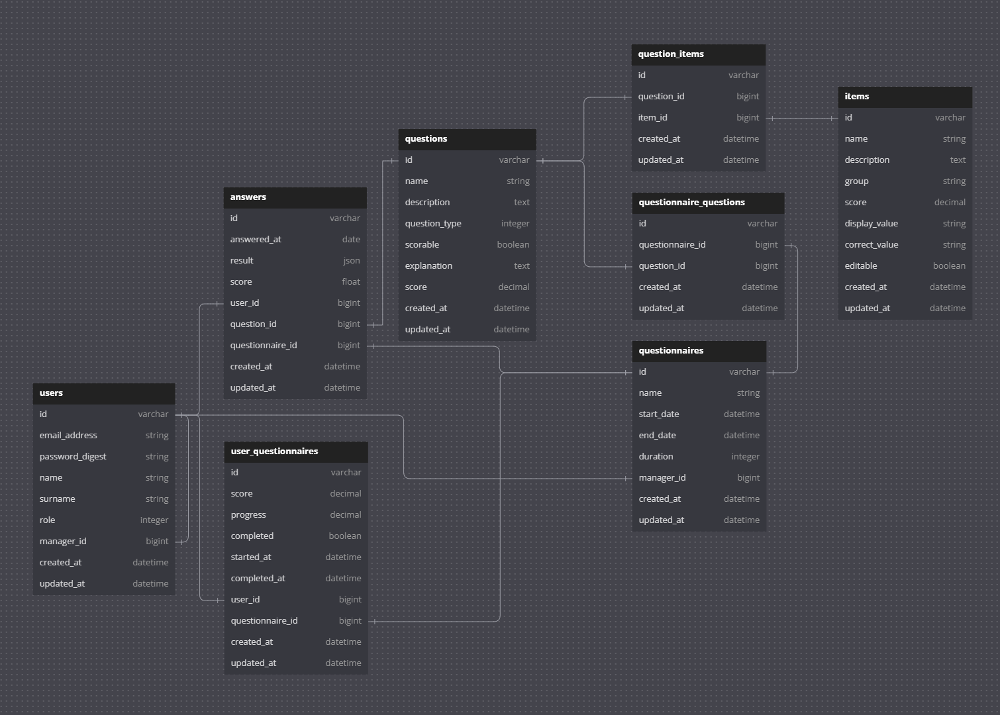

# Prueba Técnica Ruby on Rails

## Índice
1. [Enunciado](#enunciado)
2. [Diseño y desarrolllo](#diseño-y-desarrollo)
3. [Diagrama](#diagrama)
4. [Implementación](#implementación)
5. [Modelado de datos](#modelado-de-datos)
6. [Validaciones y Lógica en los Modelos](#validaciones-y-lógica-en-los-modelos)
7. [Conclusión](#conclusión)
8. [Entorno Pruebas](#entorno-pruebas)

---

## Enunciado

Se quiere una nueva funcionalidad mediante la cual, el administrador de la misma pueda crear exámenes para ser completados por los usuarios de la plataforma ya existentes.

Estos exámenes constan de varias preguntas y dichas preguntas pueden ser de diferentes tipos, concretamente nos comunican que les hacen falta 3 tipos: 
  1. Preguntas de texto libre
  2. Preguntas de selección múltiple (varias respuestas correctas)
  3. Preguntas de selección única (una respuesta correcta).

Además, las preguntas se podrán marcar como preguntas puntuables o no y en función de si se marca esta opción, el manager podrá definir cuántos puntos vale dicha pregunta.

Además, estos exámenes solo podrán ser completados por los usuarios en las fechas establecidas por el manager. 

Las respuestas de los usuarios quedarán almacenadas de manera que el manager podrá ver para cada usuario los exámenes completados, nota obtenida y otras estadísticas. 

Necesitamos que se pinte un modelo de datos que nos permita desarrollar esta funcionalidad, también los modelos de Rails y las relaciones que crees que son necesarias para cumplir todos los requerimientos y posibles evolutivos (relaciones entre modelos y validaciones).

En caso de necesitar lógica de código para resolver algún requisito sin definir a nivel de modelo de datos, por favor, describe la solución adjunto al diagrama y razona el por qué.

---

## Diseño y desarrollo

### Análisis y criterios de aceptación

**Usuario**
- Un usuario manager puede crear exámenes.
- Un usuario manager puede crear preguntas para los exámenes.
- Un usuario no manager podrá acceder al examen y contestar las preguntas.
- El sistema debe soportar roles que distingan entre managers y usuarios no managers.

**Examen**
- Los exámenes serán creados por el manager.
- Los exámenes tendrán una fecha de inicio y cierre durante las cuales los usuarios no manager podrán completarlo.
- Los exámenes tendrán preguntas asociadas que los usuarios no manager deberán responder.
- El sistema validará que la fecha de cierre del examen sea posterior a la fecha de inicio para evitar errores de configuración.
- Cuando se complete el examen, se calcula la nota final en base a la puntuación obtenida para cada pregunta, con la posibilidad de que el manager edite manualmente la puntuación final del usuario si lo considera necesario.

**Pregunta**
- Las preguntas estarán asociadas a un examen.
- Las preguntas podrán ser reutilizadas en varios exámenes (relación many-to-many entre preguntas y exámenes).
- Las preguntas pueden ser de los siguientes tipos:
  - `FreeText` -> Permite la entrada de texto para que el usuario añada su respuesta.
  - `Simple` -> El usuario debe seleccionar una opción correcta.
  - `Multiple` -> El usuario debe seleccionar múltiples opciones correctas.
- Las preguntas pueden ser puntuables o no.
- Si la pregunta es puntuable, el manager debe establecer la puntuación.

**Respuesta**
- La respuesta está asociada a un examen, a una pregunta y a un usuario.
- La respuesta será almacenada en la base de datos.
- Dependiendo del tipo de pregunta, la respuesta almacenará texto o las opciones seleccionadas por el usuario.
- La respuesta tendrá una puntuación calculada según las respuestas correctas, incorrectas o si el manager decide ajustar manualmente la puntuación.

## Diagrama

## Implementación

Como se desconoce la base de codigo de la aplicación original, y en base al enunciado propuesto se extrapolan los siguientes datos:
Existe un modelo User y de alguna forma, un usuario es identificado como manager o administrador.
- interpretaciones:
  - el usuario es identificado como manager o administrador a traves de un campo `role` (o similar) en el que se define que posicion tiene el usuario.
  - el usuario es identificado como manager o administrador a traves de la relación con otro modelo que defina roles o políticas para establecer los privilegios de manager o administrador.
  - el usuario es identificado como manager o administrador si tiene ususario asociados, y estos usuarios se relacionan con el manager o administrador con un campo `manager_id` o similar

- Diseño y desarrollo:
  - Para hacer la nueva funcionalidad agnostica y tener el menor impacto en el proyecto base se opta por un enfoque modularizado usando rails engine
  - Este modulo será instalable en la aplicación base e implementará la funcionalidad especificada.
  - Siguiendo este enfoque se pretende conseguir escalabilidad y mantenibilidad de la funcionalidad aíslandola del resto de la aplicación base.

## Modelado de datos

### **User**

Interpretaicón del modelo de `User` que se necesita para comenzar el desarrollo.

**Atributos:**

- `email_address` (string, **obligatorio**, único): Correo electrónico del usuario.
- `role` (integer, **obligatorio**, por defecto 0): Rol del usuario (0: usuario regular, 1: manager).
- `manager_id` (bigint, opcional): Referencia al manager del usuario.

**Relaciones:**

- `belongs_to :manager` (clase `User`, opcional): Manager asignado al usuario.
- `has_many :students` (clase `User`, foreign_key `manager_id`): Usuarios que son gestionados por este manager.
- `has_many :questionnaires` (foreign_key `manager_id`): Exámenes creados por el manager.
- `has_many :answers`: Respuestas proporcionadas por el usuario.
- `has_many :user_questionnaires`: Asociaciones con exámenes que el usuario ha iniciado o completado.
- `has_many :questionnaires, through: :user_questionnaires`: Exámenes asignados al usuario.

---

### **Questionnaire**

El modelo `Questionnaire` representa los examenes

**Atributos:**

- `name` (string, **obligatorio**): Título del examen.
- `start_date` (datetime, **obligatorio**): Fecha y hora de inicio del examen.
- `end_date` (datetime, **obligatorio**): Fecha y hora de finalización del examen.
- `duration` (integer, opcional): Duración en minutos del examen.
- `manager_id` (bigint, **obligatorio**): Referencia al manager que creó el examen.
- `created_at` (datetime): Fecha y hora de creación.
- `updated_at` (datetime): Fecha y hora de última actualización.

**Relaciones:**

- `belongs_to :manager` (clase `User`): Manager que creó el examen.
- `has_many :questionnaire_questions`: Relaciones many-to-many con las preguntas.
- `has_many :questions, through: :questionnaire_questions`: Preguntas asociadas al examen.
- `has_many :user_questionnaires`: Asociaciones con usuarios que han iniciado o completado el examen.
- `has_many :users, through: :user_questionnaires`: Usuarios asignados al examen.
- `has_many :answers`: Respuestas proporcionadas en el contexto del examen.

**Validaciones:**

- `name` debe estar presente.
- `start_date` debe estar presente.
- `end_date` debe estar presente y ser posterior a `start_date`.

---

### **Question**

El modelo `Question` representa las preguntas

**Atributos:**

- `name` (string, **obligatorio**): Enunciado de la pregunta.
- `description` (text, opcional): Descripción adicional o contexto de la pregunta.
- `question_type` (integer, **obligatorio**): Tipo de pregunta (0: FreeText, 1: Simple, 2: Multiple).
- `scorable` (boolean, **obligatorio**, por defecto `false`): Indica si la pregunta es puntuable.
- `score` (decimal(6,3), opcional): Puntuación máxima asignada a la pregunta.
- `explanation` (text, opcional): Campo para explicar la solucion de pregunta. 
- `created_at` (datetime): Fecha y hora de creación.
- `updated_at` (datetime): Fecha y hora de última actualización.

**Relaciones:**

- `has_many :questionnaire_questions`: Relaciones many-to-many con los exámenes.
- `has_many :questionnaires, through: :questionnaire_questions`: Exámenes que incluyen la pregunta.
- `has_many :question_items`: Relaciones many-to-many con los ítems.
- `has_many :items, through: :question_items`: Ítems u opciones de la pregunta.
- `has_many :answers`: Respuestas proporcionadas a la pregunta por los usuarios.

---

### **Item**

El modelo `Item` representa las opciones que pueden tener las preguntas.

**Atributos:**

- `name` (string, **obligatorio**): Nombre o título del ítem.
- `description` (text, **obligatorio**): Descripción del ítem.
- `group` (string, opcional): Grupo al que pertenece el ítem (si aplica).
- `score` (decimal(6,3), **obligatorio**, por defecto `0.0`): Puntuación asociada al ítem.
- `display_value` (string, opcional): Valor que se muestra al usuario.
- `correct_value` (string, opcional): Valor que indica si el ítem es la respuesta correcta.
- `editable` (boolean, **obligatorio**, por defecto `false`): Indica si el ítem es editable.
- `created_at` (datetime): Fecha y hora de creación.
- `updated_at` (datetime): Fecha y hora de última actualización.

**Relaciones:**

- `has_many :question_items`: Relaciones many-to-many con las preguntas.
- `has_many :questions, through: :question_items`: Preguntas que utilizan el ítem.

---

### **QuestionItem**

El modelo `QuestionItem` representa la relación many-to-many entre preguntas e ítems, permitiendo asociar y reutilizar múltiples ítems en diferentes preguntas.
Añada escalabilidad y reusabilidad a la funcionalidad.

**Atributos:**

- `question_id` (bigint, **obligatorio**): Referencia a la pregunta.
- `item_id` (bigint, **obligatorio**): Referencia al ítem.
- `created_at` (datetime): Fecha y hora de creación.
- `updated_at` (datetime): Fecha y hora de última actualización.

**Relaciones:**

- `belongs_to :question`
- `belongs_to :item`

---

### **QuestionnaireQuestion**

El modelo `QuestionnaireQuestion` representa la relación many-to-many entre examenes y preguntas, permitiendo retuilizar preguntas en diferentes examenes.
Añada escalabilidad y reusabilidad a la funcionalidad.

**Atributos:**

- `questionnaire_id` (bigint, **obligatorio**): Referencia al examen.
- `question_id` (bigint, **obligatorio**): Referencia a la pregunta.
- `created_at` (datetime): Fecha y hora de creación.
- `updated_at` (datetime): Fecha y hora de última actualización.

**Relaciones:**

- `belongs_to :questionnaire`
- `belongs_to :question`

---

### **UserQuestionnaire**

El modelo `UserQuestionnaire` representa la relación many-to-many entre usuarios y examenes.
Se encarga de calcular progreso que un usuario lleva del examen y calcula la puntuación obtenida de usuario en un examen

**Atributos:**

- `user_id` (bigint, **obligatorio**): Referencia al usuario.
- `questionnaire_id` (bigint, **obligatorio**): Referencia al examen.
- `score` (decimal(6,3), **obligatorio**, por defecto `0.0`): Puntuación obtenida por el usuario en el examen.
- `progress` (decimal(6,3), **obligatorio**, por defecto `0.0`): Progreso del usuario en el examen.
- `completed` (boolean, **obligatorio**, por defecto `false`): Indica si el usuario ha completado el examen.
- `started_at` (datetime, **obligatorio**, por defecto `CURRENT_TIMESTAMP`): Fecha y hora en que el usuario inició el examen.
- `completed_at` (datetime, opcional): Fecha y hora en que el usuario completó el examen.
- `created_at` (datetime): Fecha y hora de creación.
- `updated_at` (datetime): Fecha y hora de última actualización.

**Relaciones:**

- `belongs_to :user`
- `belongs_to :questionnaire`

---

### **Answer**

El modelo `Answer` representa la respuesta de un usario a una determinada pregunta de un exámen concreto.
Almacena el contenido de la respuesta y la puntuación obtenida.

**Atributos:**

- `answered_at` (date, **obligatorio**, por defecto `CURRENT_TIMESTAMP`): Fecha y hora en que se respondió la pregunta.
- `result` (json, **obligatorio**, por defecto `{}`): Contenido de la respuesta proporcionada por el usuario.
- `score` (float, **obligatorio**, por defecto `0.0`): Puntuación obtenida en la respuesta.
- `user_id` (bigint, **obligatorio**): Referencia al usuario que respondió.
- `question_id` (bigint, **obligatorio**): Referencia a la pregunta respondida.
- `questionnaire_id` (bigint, **obligatorio**): Referencia al examen al que pertenece la pregunta.
- `created_at` (datetime): Fecha y hora de creación.
- `updated_at` (datetime): Fecha y hora de última actualización.

**Relaciones:**

- `belongs_to :user`
- `belongs_to :question`
- `belongs_to :questionnaire`

**Validaciones:**

- Se debe asegurar que las respuestas se envíen dentro del rango de fechas (`start_date` y `end_date`) del examen asociado.

---

## Validaciones y Lógica en los Modelos

A continuación, se detallan las validaciones y lógica implementadas en los modelos de la aplicación, proporcionando una visión general de cómo interactúan entre sí y cómo se garantiza la integridad de los datos.

### **Modelo Answer**

**Validaciones:**

- `validates :result, presence: true`: Se asegura de que el campo `result` esté presente y no sea nulo.

**Callbacks:**

- `after_create :update_questionnaire_progress`: Después de crear una respuesta, se actualiza el progreso del usuario en el cuestionario.

**Métodos:**

- `calculate_score(selected_answers, items)`: Calcula la puntuación de la respuesta basada en las opciones seleccionadas y los ítems de la pregunta.
  
  - **Lógica del método:**
    - Inicializa `total_score` en 0.0.
    - Itera sobre cada ítem de la pregunta.
    - Si el usuario seleccionó el ítem (`selected_answers.include?(item.display_value)`):
      - Si el ítem es correcto (`item.correct_value`), suma su puntuación.
      - Si el ítem es incorrecto, resta su puntuación.
    - Si el usuario no seleccionó el ítem:
      - Si el ítem es correcto, resta su puntuación.
      - Si el ítem es incorrecto, no afecta la puntuación.
    - Actualiza la puntuación de la respuesta con el `total_score` calculado.

- `update_questionnaire_progress`: Método privado que actualiza el progreso del usuario en el cuestionario asociado.

---

### **Modelo Item**

**Validaciones:**

- `validates :name, :description, :score, presence: true`: Asegura que los campos `name`, `description` y `score` estén presentes.

---

### **Modelo QuestionItem**

**Relaciones:**

- `belongs_to :question`: Asociación con la pregunta.
- `belongs_to :item`: Asociación con el ítem.

---

### **Modelo Question**

**Relaciones:**

**Enumeraciones:**

- `enum question_type: { free_text: 0, simple: 1, multiple: 2 }`: Define los tipos de preguntas disponibles.

**Validaciones:**

- `validates :name, :question_type, presence: true`: Asegura que los campos `name` y `question_type` estén presentes.

**Métodos:**

- `difficulty`: Calcula la dificultad de la pregunta basada en el promedio de puntuaciones obtenidas por los usuarios.

  - **Lógica del método:**
    - Verifica que existan respuestas y que la puntuación máxima (`score`) sea mayor que cero.
    - Calcula la puntuación promedio de las respuestas.
    - Convierte la puntuación promedio en un porcentaje respecto a la puntuación máxima.
    - Clasifica la dificultad:
      - `"low"` si el porcentaje está entre 75 y 100.
      - `"medium"` si el porcentaje está entre 31 y 74.
      - `"high"` si el porcentaje es menor o igual a 30.
    - En caso de error, retorna `"can't calculate"`.

---

### **Modelo Questionnaire**

**Validaciones:**

- `validates :name, :start_date, :end_date, :manager, presence: true`: Asegura que los campos `name`, `start_date`, `end_date` y `manager` estén presentes.
- `validates :duration, numericality: { only_integer: true, greater_than_or_equal_to: 0 }`: Si `duration` está presente, debe ser un entero mayor o igual a cero.
- `validate :end_date_after_start_date`: Validación personalizada que verifica que la fecha de finalización sea posterior a la de inicio.

**Scopes:**

- `scope :sorted, -> { order(start_date: :asc) }`: Ordena los cuestionarios por fecha de inicio ascendente.

**Métodos:**

- `available?`: Verifica si el cuestionario está disponible en función de las fechas de inicio y fin.
- `average_score`: Calcula la puntuación promedio obtenida por los usuarios en el cuestionario.
- `completion_percentage`: Calcula el porcentaje de usuarios que han completado el cuestionario.

**Validación Personalizada:**

- `end_date_after_start_date`: Asegura que `end_date` sea posterior a `start_date`. En caso contrario, añade un error al modelo.

---

### **Modelo UserQuestionnaire**

**Scopes:**

- `scope :completed, -> { where(completed: true, progress: 100) }`: Filtra los registros que están completados y con progreso al 100%.
- `scope :incompleted, -> { where(completed: false).where("progress < ?", 100) }`: Filtra los registros que no están completados y con progreso menor al 100%.

**Métodos:**

- `update_progress`: Actualiza el progreso del usuario en el cuestionario basado en el número de respuestas proporcionadas.
  
  - **Lógica del método:**
    - Calcula el progreso como el porcentaje de respuestas dadas respecto al total de preguntas.
    - Actualiza el campo `progress` con el valor calculado.

- `subscribed?`: Verifica si el usuario está suscrito al cuestionario.
- `manager_owner?`: Verifica si el usuario es el manager que creó el cuestionario.
- `subscribe`: Permite al usuario suscribirse al cuestionario.

  - **Lógica del método:**
    - Si el usuario es el manager del cuestionario, añade un error indicando que los managers no pueden suscribirse.
    - Si el usuario ya está suscrito, añade un error indicando que ya está suscrito.
    - Si todo es válido, guarda el registro con la fecha de inicio actual.

- `mark_as_completed`: Marca el cuestionario como completado y actualiza la puntuación.

  - **Lógica del método:**
    - Llama a `update_score` para calcular la puntuación total.
    - Actualiza los campos `completed` y `completed_at`.

**Métodos Privados:**

- `update_score`: Calcula y actualiza la puntuación total del usuario en el cuestionario.

  - **Lógica del método:**
    - Itera sobre cada respuesta del usuario.
    - Omite las respuestas que no han sido respondidas o preguntas no puntuables.
    - Llama a `calculate_score` en cada respuesta para actualizar su puntuación.
    - Actualiza el campo `score` con la suma de las puntuaciones de las respuestas.

---

## Entorno Pruebas

La aplicación está disponible para pruebas en la siguiente URL: [boodle.railsnew.dev](https://boodle.railsnew.dev)

Usuarios de prueba:

- Manager: `email: manager@test.com` | `password: test123`
- Usuarios:
  - `email: student1@test.com` | `password: test123`
  - `email: student2@test.com` | `password: test123`
  - `email: student3@test.com` | `password: test123`
